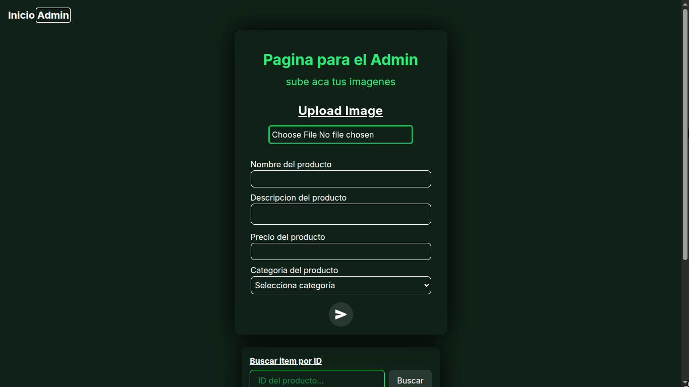
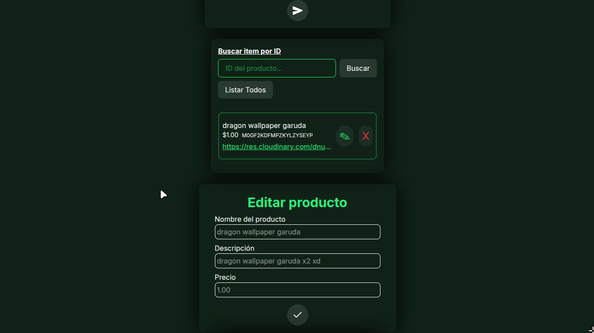
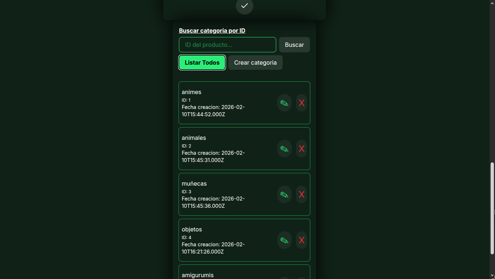

# SoulfulArt

Plataforma web de ecommerce y administración de productos artesanales. Catálogo digital para emprendedores que venden por redes sociales.

## Stack

React 19 + Vite + Tailwind CSS 4 — Express 5 — MySQL 8 — Cloudinary

## Showcase






## Lo que ofrece

- Catálogo público con búsqueda y vista detallada de productos
- Panel admin para gestionar productos y categorías (CRUD completo)
- Carga de imágenes directa a Cloudinary con optimización automática
- API REST con Express y MySQL
- Diseño responsive con modo oscuro

## Inicio rápido

```bash
# Backend
cd server && npm install && npm run dev

# Frontend
cd client && npm install && npm run dev
```

Requiere MySQL corriendo con la base de datos importada desde `database/soulfulart.sql` y archivos `.env` configurados.

## Live

https://jhon-gelvez.github.io/souful-react/
